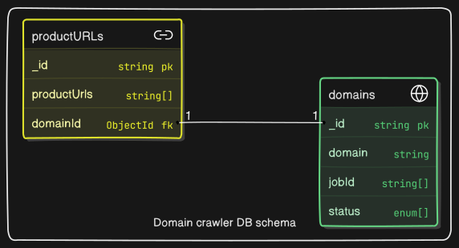
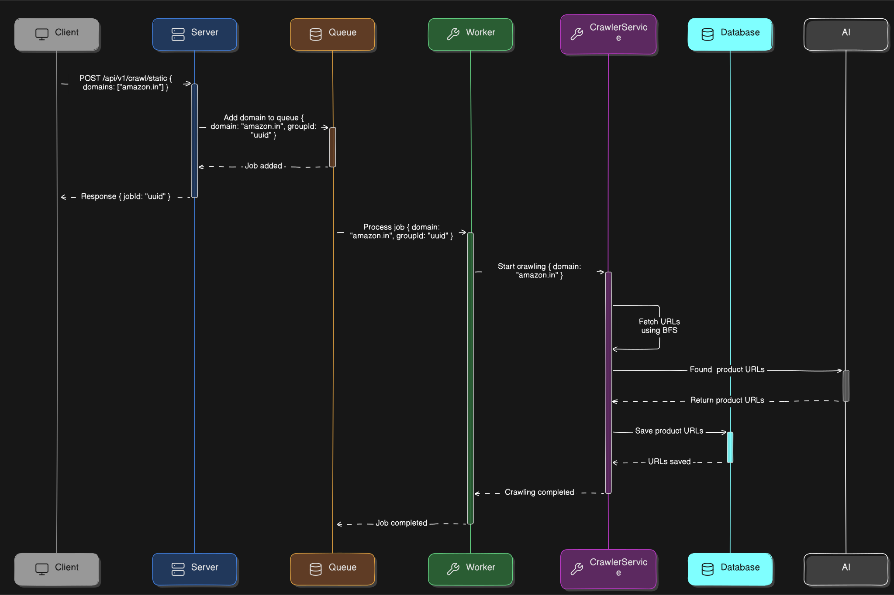

# Web Crawler for Discovering Product URLs on E-commerce Websites


A scalable web crawler designed to discover product URLs on e-commerce websites. The crawler can handle multiple domains, dynamically loaded content, and varying URL structures efficiently.

## Table of Contents

- [Introduction](#introduction)
- [Features](#features)
- [Tech Stack](#tech-stack)
- [Installation](#installation)
- [Usage](#usage)
- [Project Structure](#project-structure)
- [API Documentation](#api-documentation)
- [Diagrams](#diagrams)
- [Future Improvements](#future-improvements)
- [Contributing](#contributing)
- [License](#license)

## Introduction

This project is a web crawler built to discover product URLs on e-commerce websites. It takes a list of domains as input, crawls the websites, and returns a comprehensive list of product URLs using AI and regex as a fallback. The crawler is designed to handle dynamic content, infinite scrolling, and varying URL structures across different platforms with BFS implementation to crawl deep hierarchies with maximum depth control.

## Features

- **Scalability**: Handles a minimum of 10 domains and scales to hundreds.
- **Dynamic Content Handling**: Uses Puppeteer to crawl websites with infinite scrolling or dynamically loaded content.
- **URL Pattern Recognition**: Identifies product URLs using Google’s Gemini AI and regex patterns.
- **Performance**: Executes crawls asynchronously using BullMQ for efficient job processing.
- **Robustness**: Handles edge cases like invalid domains, non-HTML resources, and varying URL structures.

## Tech Stack

- **Backend**: Node.js, Express
- **Database**: MongoDB
- **Queue System**: BullMQ
- **Crawling**: Puppeteer, JSDOM
- **AI Integration**: Google’s Gemini AI
- **Other Tools**: Redis, Axios

## Installation

Follow these steps to set up the project locally:

### Clone the repository:

```bash
git clone https://github.com/jhalokesh/x-crawler
cd x-crawler
```

### Install dependencies:

```bash
npm install
```

### Set up environment variables:

1. Create a `.env` file in the root directory.
2. Add the following variables:

```plaintext
PORT=3000
NODE_ENV=development
MONGODB_URI=mongodb://localhost:27017
DB_NAME=crawler
GEMINI_AI_API_KEY=your-gemini-api-key
REDIS_HOST=localhost
REDIS_PORT=6379
REQUEST_DOMAIN_COUNT=10
```

### Start the server:

```bash
npm start
```

### Run tests (optional):

```bash
npm test
```

## Usage

### API Endpoints

#### 1. Static Crawler

- **Endpoint**: `POST /api/v1/crawl/static`

**Request Body:**

```json
{
    "domains": ["amazon.in", "flipkart.com"]
}
```

**Response:**

```json
{
    "jobId": "uuid",
    "crawlingOnDomains": {
        "validDomains": ["amazon.in", "flipkart.com"],
        "msg": "Only these domains might be crawled"
    },
    "unableToCrawl": {
        "invalidDomains": [],
        "msg": "These are invalid domains"
    }
}
```

#### 2. Dynamic Crawler

- **Endpoint**: `POST /api/v1/crawl/dynamic`

**Request Body:**

```json
{
    "domains": ["amazon.in", "flipkart.com"]
}
```

**Response:** Same as the static crawler.

## Project Structure

```
x-crawler/
├── src/
│   ├── app.ts              // Express app setup
│   ├── server.ts           // Server initialization
│   ├── config/             // Configuration files
│   ├── controllers/        // API controllers
│   ├── db/                 // Database models and connections
│   ├── middlewares/        // Request validation
│   ├── models/             // MongoDB schemas
│   ├── routes/             // API routes
│   ├── services/           // Business logic
│   ├── types/              // TypeScript interfaces
│   ├── utils/              // Utility functions
│   └── workers/            // Background workers for crawling
├── spec/                   // Test files
├── .env.example            // Environment variables template
├── package.json            // Project dependencies
└── README.md               // Project documentation
```

## Detailed Blog

For detail,refer to my [Blog](api_docs_link_here).

## Diagrams

1. **System Design Diagram**
   

2. **ER Diagram**
   

3. **Sequence Diagram**
   

4. **Class Diagram_CrawlService**
   

5. **Class Diagram_DomainService**
   
6. **Class Diagram_QueueService**
   

## Future Improvements

- **Concurrency**: Implement concurrency to handle multiple domains simultaneously.
- **Dead Letter Queue (DLQ)**: Handle failed jobs more efficiently.
- **Caching**: Use Redis for caching frequently accessed data.
- **Error Handling**: Improve error handling and logging for better debugging.
- **Extend Tests**: Add more unit tests, E2E, and integration tests

## Contributing

Contributions are welcome! If you'd like to contribute, please follow these steps:

1. Fork the repository.
2. Create a new branch: `git checkout -b feature/YourFeatureName`.
3. Commit your changes: `git commit -m 'Add some feature'`.
4. Push to the branch: `git push origin feature/YourFeatureName`.
5. Open a pull request.

## License

This project is licensed under the MIT License. See the [LICENSE](LICENSE) file for details.
